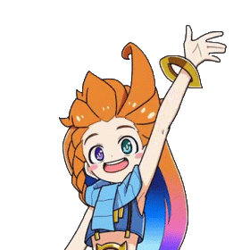

<h1 align="center">✨ Hej hej ✨</h1>

  

---
# I'm Alessio Galatolo, welcome to my profile!

- 👋 Hi, I’m @alessioGalatolo
- 💼 PhD student at Uppsala University
- 🦉 MSc in Machine Learning
- 📚 BSc in Computer Science
- 🌱 Working on LLMs and Social Robots
- 💞️ Want to collaborate? Send me an [email](mailto:alessio.galatolo@it.uu.se)!
- 🌐 [My website](https://www.alessiogalatolo.com/)
- 🎓 [Scholar Profile](https://scholar.google.com/citations?hl=en&user=Wyw_fPIAAAAJ)
<!-- - 📫 How to reach me... (don't reach me) -->
- ⚡ Fun fact: I'm a huge fan of [chocolate strawberry mooncakes](https://leagueoflegends.fandom.com/wiki/Zoe/LoL/Audio#:~:text=%22CHOCOLATE%20STRAWBERRY%20CAKE!!%22)
---

## 📚 Recent Publications
<!-- START_SCHOLAR -->
- 📄 **Promoting the Responsible Development of Speech Datasets for Mental Health and Neurological Disorders Research** (Journal of Artificial Intelligence Research 82, 937-972, 2025)
- 📄 **Look, Think, Understand: Multimodal Reasoning for Socially-Aware Robotics** (ICRA 2025 Workshop: Human-Centered Robot Learning in the Era of Big Data and …, 2025)
- 📄 **Simultaneous Text and Gesture Generation for Social Robots with Small Language Models** (Frontiers in Robotics and AI 12, 1581024, 2025)
<!-- END_SCHOLAR -->
